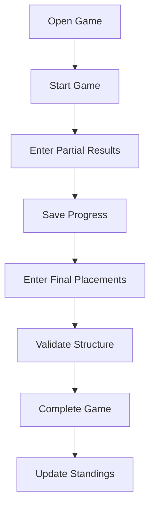
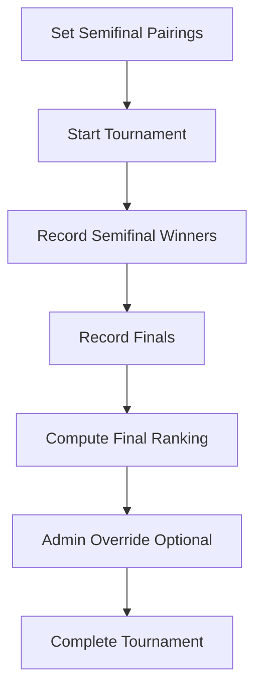
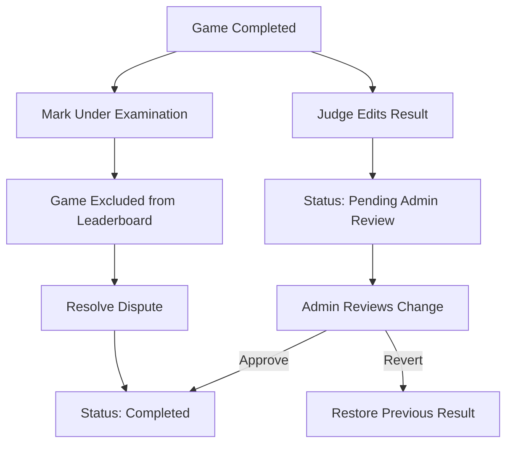

# 01_UX_Analysis

## Executive Summary

PalioBoard (Palio Control) is a rules‑aware event operations web application designed to manage the Palio Collepassese competition. The system focuses on **fast result entry, automatic standings calculation, and public visibility** during live events.

Unlike generic sports management tools, the platform is tailored to the Palio structure: four fixed teams (rioni), a 4‑3‑2‑1 scoring system, optional ties, a one‑time Jolly bonus per team, and separate but related competition contexts (Palio, Prepalio, and Giocasport).

The application prioritizes **administrative reliability and operational efficiency**, allowing judges and admins to record results quickly while automatically updating leaderboards and maintaining a full audit trail of changes.

The platform includes:

- An **operations interface** for admins and judges
- A **public read‑only interface** for spectators
- A **maxi‑screen mode** for public display during events

---

# Personas

## 1. Admin (Event Organizer)

**Role**
Manages the entire season configuration and oversees results.

**Responsibilities**

- Configure games and competitions
- Manage teams (rioni)
- Configure scoring rules
- Apply manual leaderboard adjustments
- Review edits and audit logs

**Needs**

- Reliable configuration tools
- Transparent audit trail
- Clear competition structure
- Ability to override automated rankings when needed

## 2. Judge (Operational User)

**Role**
Records results during live games.

**Responsibilities**

- Start games
- Enter results during play
- Record placements and optional metrics
- Complete games
- Handle disputes or appeals

**Needs**

- Very fast result entry
- Minimal friction UI
- Clear game state indicators
- Ability to save partial results

## 3. Public Viewer (Spectator)

**Role**
Follows the event in real time.

**Responsibilities**

- None (read‑only)

**Needs**

- Immediate visibility of results
- Clear standings
- Ability to see game history
- Understand provisional results during disputes

---

# User Goals

## Admin Goals

- Configure the season before the event
- Ensure the system reflects official rules
- Maintain data integrity and trust
- Handle disputes and corrections transparently

## Judge Goals

- Quickly record game outcomes
- Save partial results during a game
- Complete games without errors
- Clearly signal exceptional states (appeals, disputes)

## Public Goals

- Follow the event live
- Understand standings and rankings
- See the latest results instantly

---

# User Journeys

## Admin Setup Journey

1. Create season
2. Configure teams (rioni)
3. Add games
4. Assign competition type (Palio / Prepalio / Giocasport)
5. Configure templates and scoring
6. Publish configuration for event operations

## Judge Live Operation Journey

1. Open game page
2. Start game
3. Enter partial results during play
4. Enter final placements
5. Complete game
6. System updates leaderboard automatically

## Public Viewer Journey

1. Open public site
2. Select competition (Palio / Prepalio / Giocasport)
3. View leaderboard
4. View recent game results
5. Check game status if under examination

---

# Application Modules

## 1. Season Configuration

Admin interface for managing the competition setup.

Features:

- Team management
- Game creation
- Competition configuration
- Points table configuration

## 2. Game Management

Handles lifecycle and configuration of games.

Features:

- Ranking template configuration
- 1v1 tournament configuration
- Field selection and labels

## 3. Result Entry

Operational module used by judges during games.

Features:

- Start game
- Enter partial results
- Record placements
- Complete game

## 4. Standings Engine

Responsible for computing rankings automatically.

Handles:

- 4‑3‑2‑1 scoring
- ties
- Jolly multiplier
- Prepalio aggregation

## 5. Tournament Engine

Manages the fixed 1v1 tournament structure.

Handles:

- semifinal pairings
- match winners
- automatic ranking derivation

## 6. Audit & Review System

Tracks all changes to ensure transparency.

Logs:

- who changed data
- when change occurred
- before/after values
- reason for change

## 7. Public Viewer

Read‑only interface for spectators.

Displays:

- standings
- game results
- game notes
- Jolly usage

## 8. Maxi‑Screen Mode

Dedicated large-screen presentation interface for live events.

---

# Navigation Tree

Admin/Judge Navigation

Dashboard
├── Competitions
│ ├── Palio
│ ├── Prepalio
│ └── Giocasport
│
├── Games
│ ├── Game List
│ └── Game Detail
│
├── Standings
│ ├── Palio Leaderboard
│ ├── Prepalio Leaderboard
│ └── Giocasport Leaderboard
│
├── Jolly Overview
│
├── Season Setup
│ ├── Teams
│ ├── Games
│ └── Points Configuration
│
└── Audit Log

Public Navigation

Home
├── Palio
│ ├── Standings
│ └── Game Results
│
├── Prepalio
│ ├── Standings
│ └── Game Results
│
├── Giocasport
│ ├── Standings
│ └── Game Results
│
└── Jolly Summary

---

# User Flow Diagrams

## Game Result Entry Flow

## 1v1 Tournament Flow

## Appeal / Review Flow

