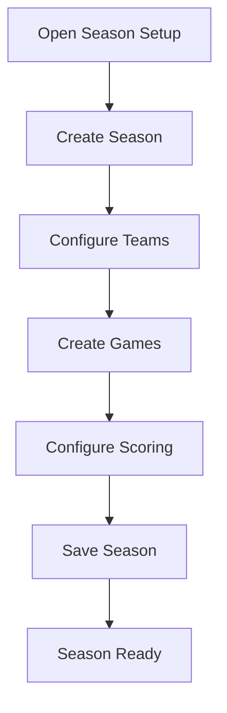
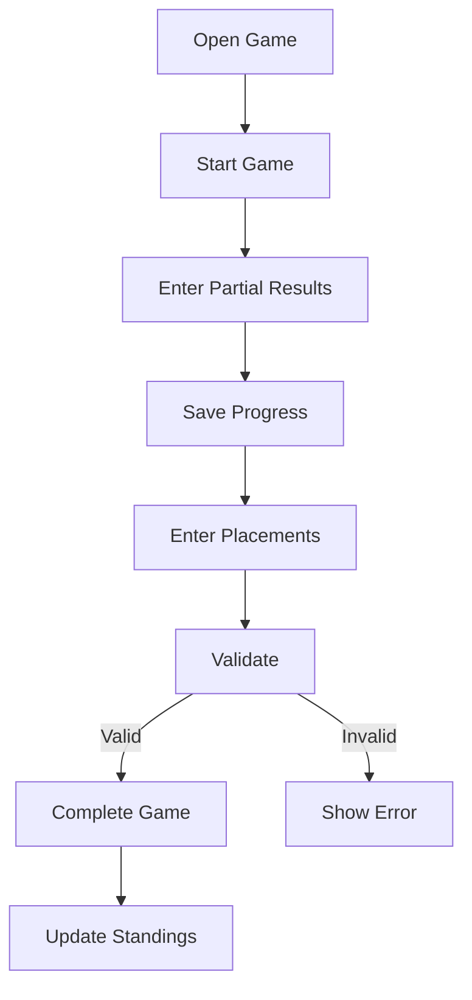

# 02_User_Flows.md

# PalioBoard — User Flows

This document defines the operational user flows for the PalioBoard application based on the PRD and UX Analysis.

The system is a rules‑aware event control platform for managing the Palio competition with fast result entry, automatic standings, and public visibility.

---

# Table of Flows

| ID | Flow | Actors | Description |
|---|---|---|---|
| F1 | Season Setup | Admin | Configure teams, games, and competition settings |
| F2 | Manage Teams | Admin | Create or edit rioni before results exist |
| F3 | Create Game | Admin | Configure a new game |
| F4 | Ranking Game Result Entry | Judge/Admin | Enter results during live games |
| F5 | 1v1 Tournament Flow | Judge/Admin | Manage quadrangular tournament |
| F6 | Jolly Usage | Judge/Admin | Declare and validate Jolly usage |
| F7 | Manual Standings Adjustment | Admin | Apply manual point corrections |
| F8 | Appeal / Under Examination | Judge/Admin | Handle disputes |
| F9 | Post‑Completion Edit Review | Admin | Review edits |
| F10 | Public Viewer Experience | Public | View standings and results |
| F11 | Maxi Screen Mode | Public | Large event display |
| F12 | Audit Log Inspection | Admin | Inspect change history |

---

# F1 — Season Setup

Actors: Admin

Steps
1. Open Season Setup
2. Create season
3. Configure teams
4. Create games
5. Configure scoring
6. Save configuration

---

# F4 — Ranking Game Result Entry

Actors: Judge, Admin

Steps
1. Open game
2. Start game
3. Enter partial results
4. Save progress
5. Enter placements
6. Validate
7. Complete game
8. Update standings

