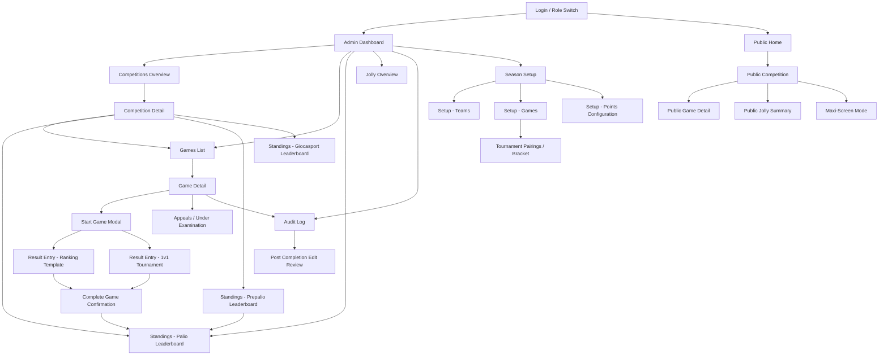

# 03_Wireframes_and_Screen_Map

**Sources:** PRD, UX Analysis, User Flows

---

## 1. Screen Inventory

1. Admin Dashboard
2. Competitions Overview
3. Competition Detail (Palio / Prepalio / Giocasport)
4. Season Setup — Teams
5. Season Setup — Games
6. Season Setup — Points Configuration
7. Games List (by competition)
8. Game Create / Edit (Ranking template)
9. Game Create / Edit (1v1 tournament template)
10. Game Detail — Live Result Entry (Ranking)
11. Game Detail — Live Result Entry (1v1 Tournament)
12. Start Game modal / controls
13. Complete Game confirmation
14. Standings — Palio Leaderboard
15. Standings — Prepalio Leaderboard & subgame rollup
16. Standings — Giocasport Leaderboard
17. Jolly Overview / Jolly Summary per Rione
18. Tournament Pairings (semifinals) & Bracket View
19. Manual Standings Adjustment modal
20. Appeals / Under Examination management
21. Audit Log / Change History
22. Post-Completion Edit Review
23. Maxi‑Screen Mode (read‑only)
24. Public Home
25. Public Competition — Standings & Results
26. Public Game Detail (provisional flags, notes)
27. Public Jolly Summary
28. Login / Role Switch (Admin <-> Judge)

---

## 2. Screen Map



---

## 3. Wireframes

> Note: ASCII wireframes show low-fidelity layout blocks. Each screen includes Purpose, Entry point, UI components, Layout description, User actions, Navigation links, Error & empty states.

---

### Screen: Admin Dashboard

Purpose: single-pane overview for admins/judges — quick access to competitions, live games, alerts (appeals/Jolly), and shortcuts to start games.
Entry point: after login

UI components:

- Top nav (burger menu button, logo, logged user info)
- Left nav (Dashboard, Competitions, Games, Standings, Season Setup, Audit)
- Main area: Live games list, Quick actions, Leaderboard snapshot, Alerts
- Footer: support link, version

Layout (ASCII):

```
[TopNav]
[LeftNav]

[Main]
[Live Games   ] [Leaderboard snapshot]
[ - Game A ►  ] [ Palio: Bosco 7 Tafuri 6 ...]
[ - Game B ►  ] [ Prepalio: ...         ]

[Alerts: 2 appeals open | 1 under-exam]

[Footer]
```

User actions: open game, start game, open standings, view audit
Navigation links: Games List, Competitions, Standings, Jolly Overview
Error state: cannot load live games -> show inline retry with error message
Empty state: no live games -> show CTA "Create / schedule a game"

---

### Screen: Competitions Overview

Purpose: choose Palio / Prepalio / Giocasport and see competition summary
Entry point: Left nav or Dashboard

UI components: competition cards, create competition button (admin), season selector

Layout:

```
[TopNav]
[LeftNav]

[Main]
[Search] [Filter: Palio / Prepalio / Giocasport]

[Card] Palio  | Games: 28 | Standings link | Jolly ✓
[Card] Prepalio| Subgames: 4 | Rollup preview
[Card] Giocasport | Standings link (separate)

[CTA: Create New Competition]
```

Error: cards failed -> retry; Empty: show guidance copy and CTA to create competition

---

### Screen: Season Setup — Teams

Purpose: create/edit the four Rioni, colors, default names
Entry point: Season Setup in left nav

UI components: list of 4 rioni (editable), Add/Edit modal, color picker, save

Layout:

```
[TopNav]
[LeftNav]

[Main]
[Teams table]
| Rione | Color | Captain | Actions Edit ]
| Bosco | Green  | --      | [Edit]          |
| Tafuri| White  | --      | [Edit]          |

[CTA: Save Season]
```

Constraints: exactly 4 rioni enforced (error if admin tries to add 5)
Empty state: pre-filled defaults shown; actionable hints

---

### Screen: Season Setup — Games

Purpose: admin creates games, selects competition type and template
Entry point: Season Setup > Games

UI components: games list, create game button, game card with template, enabled optional fields control

Layout:

```
[Games List]
[ + Create Game ]

[Game Card]
Title: "Tiro alla fune (maschile)"
Type: Palio | Template: Ranking
Options: Time? Quantity? Penalties? Public notes?
[Edit] [Delete]
```

Rules: Delete blocked if any result exists -> show tooltip explaining

---

### Screen: Game Create / Edit (Ranking template)

Purpose: configure a ranking game (fields, labels, points table, Jolly allowed flag)
Entry point: Season Setup -> Create Game

UI components: form inputs (title, competition, template, enabled optional fields, custom label for quantity), points table editor, save/cancel

Layout:

```
[Title Input]
[Competition: Palio ▼] [Template: Ranking]
[Optional fields]
[  ] Time  [  ] Quantity (label: ___ ) [  ] Penalties [  ] Public notes

[Points table] 4,3,2,1 (editable)
[Save] [Cancel]
```

Error: missing required fields -> inline validation

---

### Screen: Game Create / Edit (1v1 tournament template)

Purpose: configure quadrangular tournament (semifinals structure)
Entry: Season Setup -> Create Game -> choose 1v1

UI components: bracket pairing area, manual override toggle, enable/disable fields

Layout:

```
[Game Title]
[Pairings area]
Semifinal 1: [Rione A ▲] vs [Rione B ▲]
Semifinal 2: [Rione C] vs [Rione D]
[Save Pairings] [Auto-assign]
```

Edge: if pairings incomplete -> show warning; cannot complete tournament until pairings set

---

### Screen: Games List (by competition)

Purpose: list all games for chosen competition with states and quick actions
Entry: Competitions > View > Games or Left nav > Games

UI components: table with game title, template, state (draft / in progress / completed / under examination), actions (Start, Edit, Audit)

Layout:

```
[Filter: All | Draft | Live | Completed]
| Game | Template | State | Actions |
| Tiro alla fune | Ranking | Draft | [Start] [Edit]
| Bandierina      | Ranking | In Progress | [Open] [Audit]
```

Empty state: no games -> CTA create

---

### Screen: Game Detail — Live Result Entry (Ranking template)

Purpose: judge enters partial and final results for a ranking template game
Entry: Games List -> Open Game or Dashboard quick action

UI components:

- Game header: title, competition, state, Jolly indicators per rione
- Controls: Start game, Save draft, Complete game
- Result table: one row per rione showing fields (placement, quantity with custom label, time, penalties, notes), inline validation
- Side panel: rules & required fields, audit quick link

Layout:

```
[Game Header: <Title>  State: Draft -> [Start game]]
[Top Controls: Start | Save draft | Complete]

[Result Table]
| Rione    | Placement ▼ | <Qty label> | Time | Penalties | Jolly? |
| Bosco    | [1]         | [34 pts]    | [3:21]| [0]      | [ Jolly ✓ ]
| Tafuri   | [2]         | [30 pts]    | [3:55]| [0]      | [ ]
| Carrozzini| [3]        | [25 pts]    | [4:10]| [ -1 ]   | [ ]
| Castello | [4]         | [20 pts]    | [5:00]| [0]      | [ ]

[Validation messages inline]
```

User actions: type values, mark Jolly (only allowed in Palio and if unused), Save Draft, Complete Game (triggers validation)
Validation: must have all four rioni; placements valid (ties allowed as `1,2,2,4`); required fields filled.
Error states: validation failures block Complete with inline messages; network save failure -> show toast and retry.
Empty state: before start show prominent [Start game] CTA and instructions

---

### Screen: Start Game modal / controls

Purpose: confirm starting a game, allow setting initial pairings (1v1), and lock certain settings
Entry: from Game Detail or Games List Start action

UI components: modal with checklist (all 4 rioni present, pairings set), Start button

Layout:

```
[Modal]
Title: "Start game: Tiro alla fune"
[ ] All teams present
[ ] Jolly declared? (Palio only) -> [Declare Jolly]
[Start game] [Cancel]
```

Edge: if condition fails show explanatory message and disable Start

---

### Screen: Game Detail — Live Result Entry (1v1 tournament)

Purpose: record semifinal winners and finals, compute final ranking automatically
Entry: Games List -> Open 1v1 Game

UI components: bracket view, winner pickers, compute ranking button, override controls

Layout:

```
[Bracket]
Semifinal 1: [Bosco] vs [Tafuri] -> Winner: [Bosco ▼]
Semifinal 2: [Carrozzini] vs [Castello] -> Winner: [Castello ▼]

[Finals]
3rd/4th: auto from losers [select override]
1st/2nd: auto from winners [select override]

[Compute final ranking] [Override] [Complete]
```

Edge: if admin overrides computed ranking -> record audit reason required

---

### Screen: Complete Game confirmation

Purpose: confirm finalization, run validations, and publish to public site
Entry: after pressing Complete Game

UI components: modal showing summary and validation errors; Confirm button

Layout:

```
[Modal]
Summary: placements + points preview (with Jolly applied)
[Validation errors list if any]
[Confirm Complete] [Cancel]
```

Behavior: on confirm, update standings and create audit entry; show success toast

---

### Screen: Standings — Palio Leaderboard

Purpose: show live computed leaderboard with audit indicators and manual adjustments
Entry: Left nav > Standings > Palio or Dashboard snapshot

UI components: leaderboard table, filters, manual-adjust button, view history per rione

Layout:

```
[Filters: Season ▼ | Reset]
[Table]
| Rank | Rione | Points | Firsts | Jolly used | Actions |
| 1    | Bosco | 27     | 8      | 1/1       | [History]

[Manual adjustment CTA]
```

Error: standings failed to compute -> show explanation and provide rollback button
Empty: no completed games -> show message "No results yet — standings will appear here"

---

### Screen: Prepalio Leaderboard & subgame rollup

Purpose: show subgames, their points, intermediate aggregated ranking, and final rollup to Palio
Entry: Standings > Prepalio

UI components: subgames list with points per rione, aggregated Prepalio ranking, rollup preview button

Layout:

```
[Subgames]
- Streetball: Bosco 4 Tafuri 3 ...
- Bocce: ...

[Aggregated Prepalio Ranking]
[Apply rollup to Palio]

```

Edge: tie unresolved -> allow admin override and require audit reason

---

### Screen: Jolly Overview / Jolly Summary per Rione

Purpose: show which rioni used their Jolly and in which games
Entry: Left nav > Jolly Overview or Public > Jolly Summary

UI components: grid per rione, game list, Jolly status indicators

Layout:

```
[Jolly Summary]
[Bosco]  Used: 1/1  -> Game: "Gimkana" (2x applied)
[Tafuri] Used: 0/1
[Export CSV]
```

Empty state: no Jolly used -> instructional copy

---

### Screen: Manual Standings Adjustment modal

Purpose: admins apply point adjustments (audit required)
Entry: Standings > Manual adjust

UI components: adjustment input, reason textarea (required), preview, submit

Layout:

```
[Modal]
Adjust Rione: [Bosco ▼]
Change: [-2] points
Reason (required): [__________]
[Preview effect] [Submit] [Cancel]
```

Validation: reason required; confirm creates audit entry

---

### Screen: Appeals / Under Examination management

Purpose: track appeals filed within 15-minute window, mark game under examination
Entry: Dashboard alerts, Game Detail

UI components: appeals list, ability to mark game under examination, file upload for evidence, decision controls

Layout:

```
[Appeals]
| Game | Rione | Filed at | Status | Actions |
| Game A | Tafuri | 20:12 | Open | [View] [Mark under exam]
```

Behavior: marking under examination excludes game from leaderboard until resolved

---

### Screen: Audit Log / Change History

Purpose: view full audit trail with filters and diff view
Entry: Left nav > Audit

UI components: filter by user / game / action / date, list, expand to see before/after values

Layout:

```
[Filters: User | Game | Date Range]
[Audit list]
- 2026-03-10 20:11 | JudgePaolo | Completed Game: "Bandierina" | Changed placements 2->1
[Expand] shows before/after and reason
```

---

### Screen: Post-Completion Edit Review

Purpose: admin reviews edits on completed games (pending admin review), approve or revert
Entry: Dashboard alerts or Audit > Pending review

UI: show original vs edited result, approve/revert buttons, reason required for revert

---

### Screen: Tournament Pairings & Bracket View

Purpose: set semifinals before starting tournament
Entry: Game Create/Edit (1v1) or Games List

UI: drag-and-drop pairings, auto-assign, save

---

### Screen: Maxi‑Screen Mode (read‑only)

Purpose: large public display with compact standings and current/next game
Entry: Public > Maxi-Screen link

UI components: full-screen scoreboard, large typography, rotate between Standings / Live Game / Next

Layout:

```
[FULLSCREEN]
[Top: Event name]
[Center: Leaderboard big]
[Bottom-left: Current game (provisional badge if under exam)]
[Bottom-right: Next game]
```

---

### Screen: Public Home

Purpose: public entry point — choose competition and view highlights

Layout:

```
[Header: PalioBoard public]
[Hero: Today: 3 live games | Standings snapshot]
[Competitions: Palio | Prepalio | Giocasport]
[Footer]
```

---

### Screen: Public Competition — Standings & Results

Purpose: show standings, recent games, and link to game details

UI: clear labels for provisional/under examination games, Jolly indicators

---

### Screen: Public Game Detail

Purpose: show result details, public notes, provisional flag, appeal info

UI: show placements, quantities with configured labels, time, penalties, notes, and a clearly visible status badge (Completed / Under examination / Pending review)

```
[Game title]
[Status: PROVISIONAL - under examination]
[Placements table]
[Public notes]
```

---

### Screen: Login / Role Switch

Purpose: authenticate and allow quick switch between Admin and Judge personas (if permitted)

UI: simple login form;

---

## 4. Navigation relationships

- Login -> Admin Dashboard or Public Home
- Admin Dashboard -> Competitions Overview, Games List, Standings, Jolly Overview, Audit Log
- Competitions Overview -> Competition Detail -> Games List -> Game Detail -> Result Entry / Start Game
- Games List -> Create Game -> Game Create/Edit
- Game Detail -> Start Game modal -> Result Entry -> Complete Game -> Standings update
- Standings (Prepalio) -> apply rollup -> Palio Standings
- Game Detail -> Appeals -> Mark Under Examination -> affects Standings
- Audit log -> View entry -> Jump to affected Game Detail
- Public Home -> Public Competition -> Public Game Detail -> Maxi-Screen

---

_End of wireframes document._
